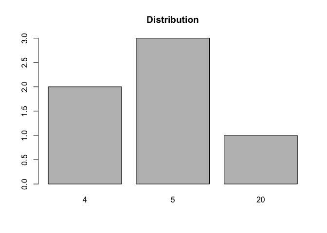
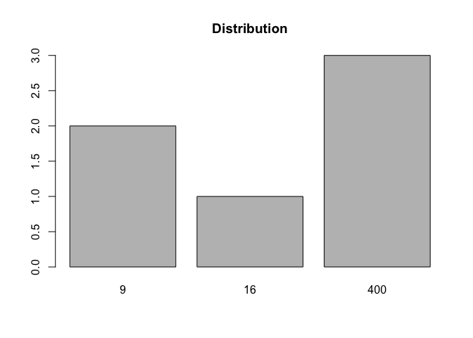

<!-- README.md is generated from README.Rmd. Please edit that file -->

# Fnpol

<!-- badges: start -->

[](https://github.com/vincehass/Advanced-Computational-Statistics-and-Functional-Programming/tree/master/1-Fnpol)
<!-- badges: end -->

The goal of fnpol is to provide functionalities for fast computation for
the following methods: Fast fourrier methods, inverse generator
simulation and polynomials series.

### Author: Nadhir Hassen

## Installation

You can install the released version of fnpol from
[CRAN](https://CRAN.R-project.org) with:

``` r
install.packages("fnpol")
```

``` r
library(fnpol)
devtools::load_all()
#> Loading fnpol
```

This package describes functionalities for fast computation with the
following methods: Fast fourier method `fft_c2`, random variable
simulator which provides transformation such as sum `simulateur_sum`,
proportion `simulateur_prop` and summary distribution `simulateur_bar`.
In addition, we provide a class of polynomial that return a symbolic
polynomials, their transformation such that sum of polynomials,
multiplication of polynomials, derivative of polynomials and summary
statistics which give their respective factorization.

## Fast Fourier Method

The fourier transform is defined as the sum of \(N\) complexs number
\((X_k)_{k=0}^{N-1}\) such that

where \(i\) is the imaginary part and the complex serie
\((x_n)_{n=0}^{N-1}\) \(\in \mathbb{C}\).

### Naive form Fast Fourier Inverse

``` r
vec_com<-sample(complex(real=sample(1:20,16), imaginary = sample(1:20,16)),16)
vec_com
#>  [1]  5+ 8i  2+14i 18+ 9i 10+ 7i 15+ 4i 19+ 6i 16+10i 17+ 5i  6+11i  3+17i
#> [11]  1+ 2i 12+20i 11+16i 14+15i  4+18i 20+19i
dft1_naive(vec_com,k=3)
#> [1] -17.36409
```

### Iterative Form for Fast Fourier Transform

``` r

dft1_iter(vec_com,k=3)
#> [1] -17.36409
```

### Matrix Form for Fast Fourier Transform

``` r

dft1_matrix(vec_com,k=3)
#>           [,1]
#> [1,] -17.36409
```

### Comparaison of all methods for Fast Fourier Transform

``` r
c(all.equal(dft_factory_all(vec_com)[,1], Im(fft(vec_com))),
  all.equal(dft_factory_all(vec_com)[,2], Im(fft(vec_com))),
  all.equal(dft_factory_all(vec_com)[,3], Im(fft(vec_com))))
#> [1] TRUE TRUE TRUE
```

### Fibonacci sequence

``` r
fib_mulPos_rec(3)
#> [1] 6
```

### Scalable Fast Fourier Transform

We use a recursive algorithm to calculate the fast Fourier transform.
This method allows us to benefit from an important concept in
algorithmic “divide to conquer”. For this we decompose the Fourier
transform into an even and odd sequence and exploit the symmetry of this
decomposition such that

Using symmetry allows us to halve the computational complexity by going
from \(\mathcal{O}(N^2)\) to \(\mathcal{O}(M^2)\), for \(0\leq k < N\)
and \(0\leq n <M / 2\). In addition, using the recursive method has
allowed us to further reduce this complexity. Therically this method
reaches a complexity (assymptotically) of \(\mathcal{O}(N\log N)\). We
implement the algorithm below.

``` r
fft_ct2(vec_com)
#>  [1] 173.000000+181.000000i -37.833566-  9.508459i -32.000000+ 35.355339i
#>  [4]   6.702966- 17.364094i  -1.000000+ 21.000000i -30.347867-  0.161973i
#>  [7]  20.384776+ 23.455844i -10.757302+ 22.239852i -21.000000- 25.000000i
#> [10]  17.490420- 24.290531i -32.000000- 35.355339i   6.811752- 42.861303i
#> [13]  -3.000000- 21.000000i  -1.308987+  5.960962i -16.384776- 27.455844i
#> [16]  41.242584+ 41.985544i
```

## Comparaison tool Fast Fourier Transform

``` r
all.equal(fft_ct2(vec_com), fft(vec_com))
#> [1] TRUE
```

## Generator of random variable

### Generator of a transformed Discrete distribution

This function generate a vector of realization from the same
distribution of the input vector. The user can specify a transformation
on the input vector otherwise it will return the identity
transformation.

``` r
f2<-function(x) x**2;
xs<-c(10,3,5,20,4,6);
simulator_tran<-function(xs,trans=identity) lapply(list(length(xs)),simulator(xs, trans))
sim_tran<-simulator_tran(xs)
```

### Generator of a sum of random variables

This function allows to the user to generate the sum of two generators.
The user could specify a transformation for the input otherwise it will
return the identity transformation. We give two examples, the first with
no transformation and the second with a transformation such as
\(f(x) = x^2\).

``` r
simulator_sum<-function(v1,v2,trans=identity){
lapply(list(length(c(v1,v2))),realization_sum(v1,v2, trans))};
simulator_sum(c(1,2,3),c(2,3,4), identity);
#> [[1]]
#> [1] 5 5 5 5 7 5
f2<-function(x) x**2;
sim_sum<-simulator_sum(c(1,2,3),c(2,3,4), f2);
sim_sum
#> [[1]]
#> [1] 25 49 49 25 49  9
```

### Proportion of the simulated random variable

``` r
f2<-function(x) x**2;
xs<-c(10,3,5,20,4,6);
sim_tran<-simulator_tran(xs)
sim_tran2<-simulator_tran(xs,f2);
simulator_prop(sim_tran);
#> 
#>  5  6 10 20 
#>  1  1  1  3
simulator_prop(sim_tran2)
#> 
#>   9 100 400 
#>   1   1   4
```

### Histogram of realized random variables

``` r
f2<-function(x) x**2;
xs<-c(10,3,5,20,4,6);
sim_tran<-simulator_tran(xs)
sim_tran2<-simulator_tran(xs,f2);
simulator_prop(sim_tran);
#> 
#>  4  6 10 20 
#>  1  1  2  2
simulator_bar(sim_tran);
```



``` r
simulator_bar(sim_tran2)
```



### Random variable Sequence Generator

This function allows to calculate the longest bounded sequence given a
defined arithmetic operation. We can simply track the decomposition of a
selected operation, we give two examples below.

``` r
w<-sequence_long(sets = c(2L, 2L, 5L, 6L, 6L, 6L, 7L, 9L),
lowerb = -1e10,
upperb = 1e10,
nb_iters = 1e5L)
tracking_operator(w,k=10)
#> The result of  11  has been obtained by this set of numbers  6 9 5 2 6  and the following operation
#> [[1]]
#> function (e1, e2)  .Primitive("*")
#> 
#> [[2]]
#> function (e1, e2)  .Primitive("^")
#> 
#> [[3]]
#> function (e1, e2)  .Primitive("*")
#> 
#> [[4]]
#> function (e1, e2)  .Primitive("*")
#> 
#> [[5]]
#> function (e1, e2)  .Primitive("/")
tracking_operator(w,k=100)
#> The result of  1  has been obtained by this set of numbers  6 7 6 2 9  and the following operation
#> [[1]]
#> function (e1, e2)  .Primitive("*")
#> 
#> [[2]]
#> function (e1, e2)  .Primitive("^")
#> 
#> [[3]]
#> function (e1, e2)  .Primitive("*")
#> 
#> [[4]]
#> function (e1, e2)  .Primitive("*")
#> 
#> [[5]]
#> function (e1, e2)  .Primitive("/")
```

## Algebric description of Polynomials

The `PlynR` class allows to construct a family of polynomials in order
to manipulate arithmetic operations on polynomials and provide their
algebric decompisition. eg.: sum, multiplication, roots and
factorization.

### Algebric expression of a simple Polynom

``` r
printPol.plynR(c(1,2,30))
#> A polynom as  30*x^2 + 2*x + 1
```

### Algebric expression of a sum of Polynoms

``` r
printPol.plynR(plus.plynR(c(1,1,10), c(1,2,10)))
#> A polynom as  20*x^2 + 3*x + 2
```

### Algebric expression of a multiplication of Polynoms

``` r
printPol.plynR(fois.plynR(c(1,1,10), c(1,2,10)))
#> A polynom as  100*x^4 + 30*x^3 + 22*x^2 + 3*x + 1
```

### Algebric expression of a derivative of a Polynom

``` r
printPol.plynR(derive.plynR(c(1,1,10)))
#> A polynom as  20*x + 1
```

### Summary of Polynom with its factorization

``` r
summaryPol.plynR(plynR(c(1,2,3)))
#> Summary P(n)
#> [1] "(x+ 0.33 - 0.47i)" "(x+ 0.33 + 0.47i)"
```

You can check more the description on Cran\!
