# MAT8186: Techniques avancées en programmation statistiques R
## Bienvenue!
Tout d'abord, je vous souhaite la bienvenue sur le dépôt GitHub de
votre cours. Vous y trouverez:
* Slides de chacun des cours.
* Exercices ("Katas").
* Devoirs.
* Liens utiles / matériel supplémentaire.

Veuillez noter que nous n'utiliserons *pas* Moodle pour ce cours; *le
dépôt contiendra donc l'ensemble du matériel nécessaire*.

## Informations.
* Local du cours: PK-S1545
* Horaire: de 10h à 12h le
  * lundi: 9, 16 et 23 septembre.
  * mercredi: 4, 11, 18 et 25 septembre.

**Examen le 30 septembre de 9h30 à 12h30**

## Coordonnées.
Vous pouvez me joindre:
* par e-mail: fournier.patrick@uqam.ca
* en personne: PK-5323.

Vous pouvez en tout temps passer à mon bureau. Si je suis présent et
que j'ai du temps, il me fera plaisir de discuter / vous aider. Si
vous voulez être sûr de me rencontrer, prenez rendez-vous avec moi
auparavant.

## Logiciels à installer.
Les logiciels suivants sont nécessaires pour le cours.
* R version >= 3.5 (https://cran.r-project.org/).
* RStudio version >= 1.2 (https://www.rstudio.com/products/rstudio/).
* Git version >= 2.20 (https://git-scm.com/).

Si vous possédez déjà ces logiciels, je vous suggère de profiter du
début de la session pour vous assurer qu'ils sont bien à jour.

## Packages R à installer.
Les packages ci-dessous sont nécessaires à l'exécution des scripts R
présents sur ce dépôt. Ils sont tous disponibles sur CRAN et peuvent
donc être installés par un simple appel à `install.packages`.
* devtools
* foreach
* magrittr
* microbenchmark
* proftools
* pryr

Si vous possédez déjà ces packages, je vous suggère de profiter du
début de la session pour vous assurer qu'ils sont à jour. Pour ce
faire, à l'intérieur d'une session R, appellez

``` R
update.packages(ask = FALSE)
```

## Comment utiliser ce dépôt.
La bonne utilisation de git et, dans une moindre mesure, GitHub, fait
partie intégrante du cours. Git est à la base un outil en ligne de
commande possédant une quantité impressionnante de
fonctionnalité. Malheureusement, cela le rend relativement difficile à
maîtriser. Toutefois, RStudio fourni une interface simplifiée aux
fonctionnalités de git auxquelles nous ferrons appel. Cette section
vous liste les étapes nécessaires à la bonne utilisation du dépôt pour
le cours.

À la fin de cette section, vous aurez
1. une copie locale du dépôt qui sera en mesure de recevoir les
   changements que j'y apporterai et
2. une copie en ligne de votre dépôt local à laquelle j'aurai accès.

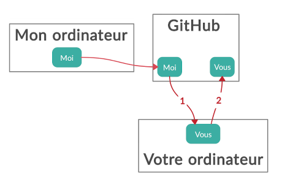

### Créez votre compte GitHub.
Le processus est standard, vous devriez facilement y arriver.

### Surveillez le dépôt.
Cette étape n'est pas nécessaire mais je vous recommande de surveiller
ce dépôt. Vous serez ainsi averti des modifications lui étant
apportés. Pour ce faire,
1. Cliquez sur le bouton `Watch` au coin supérieur droit de cette page;
   un menu déroulant apparaîtra.
2. Cliquez sur `Watching`.

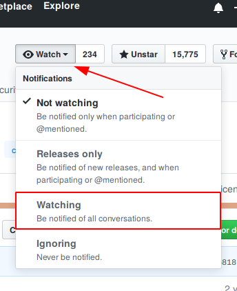

### Forkez le dépôt.
Cette étape a pour but de créer votre propre copie personnelle du
dépôt (appelée un fork). Pour la suite du cours, *vous allez
travailler exclusivement dans ce fork*.

La création du fork est extrêmement simple: il vous suffit de cliquer
sur le bouton `Fork` au coin supérieur droit de cette page, à droite du
bouton `Watch`.


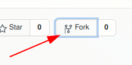

### Créez un dépôt local.
Bien qu'il soit possible de travailler directement sur votre dépôt
GitHub, cela n'est pas très pratique. La meilleure façon de procéder
est de créer un troisième dépôt localisé sur votre ordinateur. Cela
se fait aisément à l'aide de RStudio.
1. Ouvrez RStudio.
2. Sous le menu `File`, cliquez sur `New Project`.
3. Dans la boîte de dialogue, cliquez sur `Version Control`.

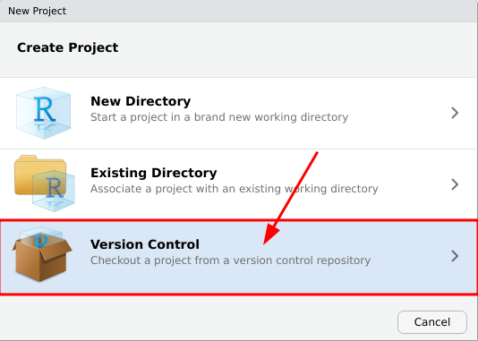

4. Dans l'écran suivant, choisissez `Git`.

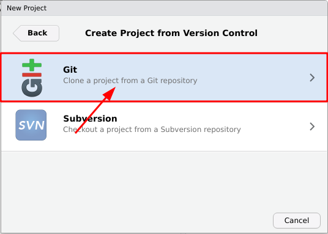

5. Dans l'écran suivant, inscrivez l'URL de *votre fork*. Celui-ci
   vous est donné lorsque vous cliquez sur le bouton `Clone or
   download` au coin supérieur droit de la page de votre fork.

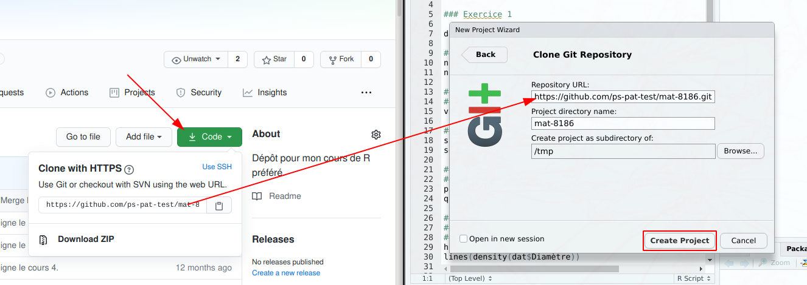

6. Cliquez sur `Create Project`.

### Ajustement des remotes.
Félicitation, vous disposez maintenant d'une copie locale de votre
fork! Toutefois, vous n'êtes pas tout à fait au bout de vos peines; il
reste un problème à régler. À ce stade, vous êtes capable d'envoyer
vos changements locaux vers la copie de votre fork hébergée sur GitHub
(flèche 2 sur le schéma du début de la section). De la même manière,
vous êtes en mesure d'intégrer les modifications apportées à la copie
distante de votre fork dans votre copie locale. Toutefois, comme vous
êtes le seul utilisateur capable d'apporter ce genre de modification,
cela ne vous est pas utile. Ce qu'il vous faut, c'est être capable
*d'intégrer mes changements à votre dépôt* (flèche 1 sur le
schéma). Attaquons-nous à ce problème.

1. Assurez-vous que RStudio est bien ouvert à votre projet (coin
   supérieur droit).

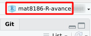

2. Dans le panneau supérieur droit, cliquez sur l'onglet `Git`. Cliquez
   sur le petit icône en forme d'engrenage dans la boîte d'outil puis
   sur `Shell...`.

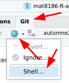

3. Dans la fenêtre qui vient de s'ouvrir, tapez les 4 commandes
   suivantes (à chaque fois suivi de `enter`):

``` Shell
git remote add upstream https://github.com/ps-pat/mat8186-R-avance.git
git fetch upstream automne2019
git branch --set-upstream-to=upstream/automne2019
git config remote.pushdefault upstream origin
```
Félicitation, vous êtes maintenant prêt à suivre le cours!

### Triangular workflow.
Retournez voir le schéma du début de la section. Remarquez que vous
intégrez les changements d'un dépôt ne vous appartenant pas tandis que
vous modifiez un dépôt vous appartenant. Cette utilisation asymétrique
de Git est connue sous le nom de Triangular workflow. Sachez que si
l'envie vous prenait de contribuer à un projet libre ou open source un
jour, il s'agit généralement du workflow employé.

### Interagir avec les différents dépôts.
Tout au long du cours, vous aurez besoin d'accomplir trois opérations de base:
* Pull
* Commit
* Push

Il est possible d'effectuer ces trois opérations directement à partir
de RStudio.

#### `git pull`: incorporer les changements les plus récents.
La première opération à maîtriser est connue sous le nom de `git
pull`. Elle correspond à la flèche 1 sur le schéma du début de la
section. En réalité, elle accomplit deux tâches:
1. Importer les changements distants (équivaut à `git fetch`).
2. Incorporer ces changements à votre dépôt local (équivaut à `git merge`).

**Important**: *Avant de procéder à un `git pull` il est essentiel de
vous assurer que vos changements locaux ont été commis (voir section
suivante). Dans le cas contraire, vous aurez droit à un message
d'erreur de la part de git.*

Voici la marche à suivre pour procéder à un `git pull` à partir de
RStudio.
1. Sous l'onglet `Git`, dans la barre d'outils, cliquez sur
   `Pull`.

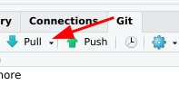

2. Si nécessaire, authentifiez-vous.
3. Une nouvelle fenêtre devrait s'ouvrir et donner une sortie
   semblable à celle illustrée ci-dessous.

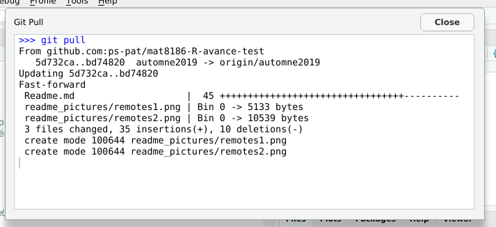

#### `git commit`: commettre vos modifications locales.
Cette opération est *toujours* préalable à la troisième opération,
`git push`. Conceptuellement, elle est quelque peu
abstraite. Toutefois, elle est relativement facile à réaliser en
général.

Il n'est pas possible de soumettre directement des changements
apportés à votre dépôt local vers votre dépôt distant. La *seule*
manière de modifier le dépôt distant est de lui intégrer une sorte de
«photo» d'un changement ou d'un ensemble de changements locaux. Dans
le jargon de Git, ces photos sont appelées commits et sont générés par
la commande `git commit`. Voici comment procéder à partir de RStudio.
1. Sous l'onglet `Git`, dans la barre d'outils, cliquez sur le bouton
   `Commit`.

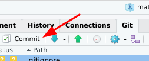

2. Dans la nouvelle fenêtre, cochez les cases de la colonne `Staged`
   correspondant aux fichiers que vous souhaitez inclure dans votre
   commit. La colonne `Status` correspondante devrait afficher `A`
   (pour added).

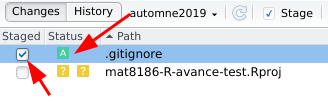

3. Tapez une *courte* description dans la boîte `Commit message`.

4. Cliquez sur `Commit`.

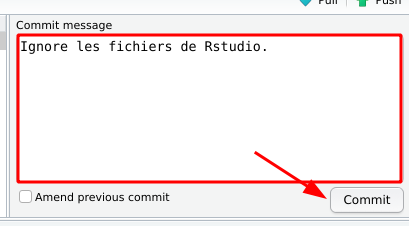

5. Une nouvelle fenêtre devrait s'ouvrir et donner une sortie
   semblable à celle illustrée ci-dessous.

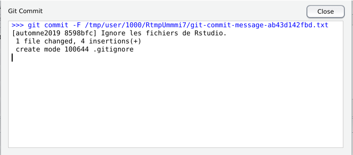

#### `git push`: envoyer vos commit vers votre dépôt distant.
Le `push` est l'opération qui consiste à envoyer vos commits vers
votre dépôt distant. Elle correspond à la flèche 2 dans le schéma du
début de la section. Pour la réaliser, sous l'onglet `Git`, dans la
barre d'outils, cliquez simplement sur `Push` et authentifiez-vous si
nécessaire.

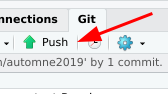

Une nouvelle fenêtre sevrait s'ouvrir et donner une sortie semblable à celle illustrée ci-dessous.

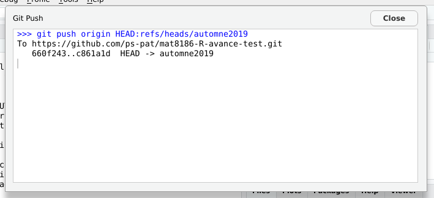

## Pour en savoir plus.
Git est un logiciel immensément populaire pour lequel il existe une
quantité impressionnante de documentation et tutoriels. Si vous
rencontrez un problème ou que vous souhaitez en apprendre davantage,
je vous recommande vivement les liens suivants:
* https://happygitwithr.com/
* https://git-scm.com/doc
